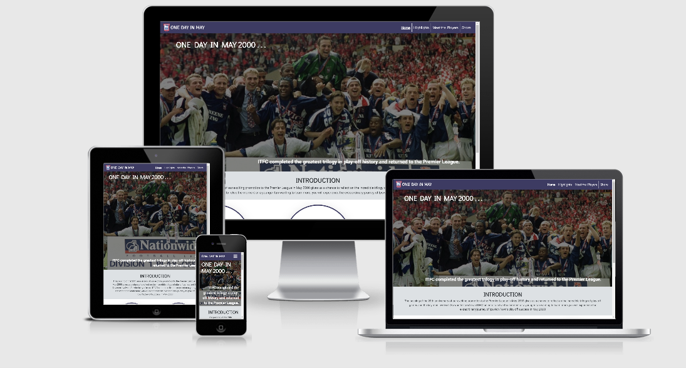
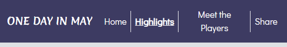

# One Day In May

My project is aimed at supporters of Ipswich Town Football Club.  The club and fans recently marked 20 years since they won promotion to the Premier League with former players joining podcasts and local radio stations to discuss their team mates, the highs and lows of the thrilling trilogy of play-off matches and the celebrations that followed.

My website serves as a hub for fans to relive the experience and for younger fans who weren't around at the time, to learn about what happened and who the main players were.  Along with the Home page, I have focused on 3 pages:
- Highlights - I have embedded YouTube highlights of the 3 games and a report of what happened in each.
- Meet the Players - This page introduces some of the key players and their contributions.  There is a photo gallery for each player.
- Share - I invite users to share their memories and photos of the playoffs by completing a form.

## UX

The website is aimed at ITFC fans so I envisage users will be a variety of age ranges.  I have also used club colours in the navigation bar and footer.  On medium sized screens upwards, the navigation bar also features the club badge.  On smaller screens, the navigation links compress behind a toggle button.  The purpose of the website is to inform and entertain Ipswich Town fans.  I have tried to achieve this by providing lots of written content but supplemented this with some embedded YouTube videos and images.

Users:
- As a user, I'd like to learn more about the state of the club in 1999-2000.
- As a user, I'd like to learn more about the play-off matches.
- As a user, I'd like to watch highlights and see photos to experience the play-off matches.
- As a user, I'd like to find out more about some of the players involved in the matches.
- As a user, if I was at any of the matches, I'd like to share some of my memories and photos.

[Click here to see my full Wireframe](wireframe/ms1-project-wireframe.pdf)

**Home page**:  Since the name of the website doesn't make it immediately clear that it is for ITFC fans, I have tried to grab users attention by using a jumbotron with a background image of Ipswich players celebrating promotion.  This should grab users attention.  I have ensured that the centre of the image is shown on all screen sizes as this is where the captain is seen holding the play-off trophy.  Beneath this is an introduction section which lets users know the purpose of the website.  There are links to the 3 other pages with a brief description of each - the purpose of this is to provide information to users about what they can find on the website through and an alternate link to reach each page (along with the navigation bar).  These links span horizontally on large screens and gradually move to a vertical alignment as the screen width gets smaller - this is achieved using Bootstrap's grid system.  I also applied a shadow effect to them to make them standout from the other content on the page.

**Highlights**:  The background section is quite lengthy so I included a link at the top which enables users to jump straight down to the highlights section.  The highlights section makes use of a Bootstrap navbar which allows users to select from highlights and reports of 3 football matches without taking up too much real-estate on the page.  Since the match reports are quite lengthy, I have added shortcuts at the bottom of them to enable users to jump up to either the background or highlights section quickly.  Since the reports contain lots of text, I have floated images relating to the match report to make them more appealing.  I utilised Bootstrap to create two different layouts for the match scores; on wider screens the result spans horizontally with the score in the middle and teams either side.  However, on smaller screen sizes, this layout didn't look good so I changed it to show both teams to the left with the scores to the right, one below the other.

**Meet the Players**:  I have inserted a football pitch as the background image to make this page more appealing and give the impression of players being on a pitch. I used similar images of each player, each wearing the same colour kit to ensure consistency across them and make it more visually appealing. I added a hover effect which makes the page more interactive; when an image is hovered over, it flips to reveal the player's name.  I considered trying to position the player images in the position that they would typically play on a pitch but decided that this would be difficult to achieve and not lead to a responsive page or positive user experience.  I opted to just to focus on 6 players.  I utilised Bootstrap to ensure these images are spaced out and the layout of them is responsive.

**Share**:  I want users to contribute their experiences, memories and photos so I have created a form for them to do so.  The form is simple and I have used labels and placeholder text to ensure it is clear what the user is expected to provide.  I have included a Reset button so users can clear all fields and start the form again.  I have applied a shadow effect to the form to help it stand out on the page.  On wider screens, the form does not need to span the whole page so I have added images either side of it.  In fact, I opted to split one image in half thinking that this would draw users in.  The image used shows the manager and assistant manager celebrating on the final whistle.  There are 2 reasons for using this image; firstly it shows the end moment of the 3 play-off matches and this is the end of the website and secondly to invoke an emotion from the user who may remember and choose to share how that moment felt for them.

## Features

### Existing features

- The Home page features a jumbotron with a zoom effect to draw attention to it.  The jumbotron text and background image will inform users what the website is about so I have added the effect to ensure it catches the eye of the user.  The effect works on all screensizes.
- The shortcut icons on the Home page have a hover effect which both enlarges the icon but also inverts the colours.  This draws attention to them and helps users know that they are clickable links.
- The Highlights page contains a background section.  This section enables users to learn more about the state the club was in in 1999-2000.  Failing in the play-offs in the 3 previous seasons is partly what made the 1999-2000 promotion more dramatic and this provides users with that knowledge.
- The Highlights page contains embedded YouTube videos of highlights of the three play-off matches.  There are images of the games too.  This enables users to experience the play-off matches.
- The Highlights page also contains a report of each match which enables users to learn more about them.
- The Meet the Players page contains a different visual effect; when player pictures are hovered over, they flip to show the player name.  When football is broadcast on TV, player lines ups often feature images and some graphic effects so I wanted to add some sort of similar effect here.  I also placed a football pitch in the background to make the page more visually appealing.  This feature enables users to learn more about the key players involved in the matches.
- When clicking on the player images on the Meet the Players page, a modal window opens up (Bootstrap was utilised for this feature).  The modal contains more images of the player and more information about them.
- Within the modals, a [Lightbox](https://www.lokeshdhakar.com/projects/lightbox2/) popout can be launched by clicking on any of the images.  Users can then scroll through a handful of each player.  I have used photos of the players from the 3 play-off matches to ensure they are relevant to the purpose of the website.
- The Share page contains a form which enables users to share their memories and photos.  This form is currently only posted to Code Institutes code dump.

### Features for future implementation

If I was to continue the development of this website, I would look to add:
- A page for users to buy merchandise and memorabilia such as kits, matchday programmes, etc.
- A "Your Memories" page containing the photos and memories that people have uploaded to the website.
- A "What Happened Next" page which explains what happened to the team and the players after winning promotion.
- More players to the Meet the Players page, possibly adding the full squad and manager.  Time constraints meant I only focused on 6 players up to now.

## Technologies Used

I used the following languages, frameworks and libraries to build this website:
- [HTML5](https://en.wikipedia.org/wiki/HTML5) - HTML5 was used to code the content of the website.
- [CSS3](https://en.wikipedia.org/wiki/Cascading_Style_Sheets) - CSS3 was used to style the content.
- [Bootstrap](https://getbootstrap.com/) - Bootstrap was used to provide a grid structure, navigation toggle effect, navigation links on the Highlights page and multiple other styles by utilising Bootstrap classes such as margins, padding, allignment of text/objects, text decoration, etc.
- [Lightbox](https://www.lokeshdhakar.com/projects/lightbox2/) - This was used to create a picture slideshow for each player on the Meet the Players page.  The Lightbox function is launched from within each players modal.  The entirety of the [Lightbox CSS library](assets/css/lightbox.css) was downloaded.
- [FontAwesome](https://fontawesome.com/) - FontAwesome was used to insert icons into the webpage.  These appear in the Home page as shortcut icons, in the footer as the social media links, on the Highlights page next to goalscorers and in the Meet the Players modals.  I also replaced the Bootstrap navigation toggle icon with one from FontAwesome.
- [Google Fonts](https://fonts.google.com/) - Google Fonts have been used to style the text in the website.  The header contains the webpage name which has Merienda One font applied, Didact Gothic font is applied to headers and the navigation menu links and the rest of the text is Roboto font.
- [FavIcon](https://www.favicon-generator.org/) - This webpage was used to create the small favicon which appears in the webpage tab.  I used the football club logo which appears in the header.

**Not used**:  [Hover](https://ianlunn.github.io/Hover/) - Early on in the project, I did add this library thinking that I would utilise it to apply extra hover effects to various elements.  However, as I developed the project, I found that using CSS hover effects was giving me the results I was looking to acheive.  Thus I ended up removing this CSS library and HTML links from my project.

## Testing

### Bugs

The ITFC logo and "One Day In May" text appears in the header (although the ITFC logo disapears on extra-small and small screens).  They act as a shortcut to the Home page.  Early on in the project I noticed that when hovering over them, a blue line appeared underneath them when I hovered over them.  This is built in behaviour which effects all achor elements.  To fix this, I created a pseudo-class in my [CSS](assets/css/style.css) to remove all text decoration from anchor elements.  This enabled me to then style anchor elements how I wanted and removed the unwanted blue line appearing under the logo and text in my header when I hovered over them.

When I was building the navigation bar, I wanted to separate each navigation link with a horizontal white line.  I decided the easiest way to do this was add a border so I added a right-border to the first 3 elements.  But when I did this which then created two problems.  The first problem was that these borders appeared when the navigation links were compressed behind the toggle icon.  I created a [CSS](assets/css/style.css) media rule to remove the borders on exrta-small screens.  The second problem is that when the screen width is around 576px - 600px, the Meet the Players link wraps across two rows.  When this happened, the right-border was double the length of the others.  To ensure the borders remained the same height, I applied a right-border to the first two navigation links, no border to the Meet the Players link and a left-border to the Share link.

1. Home page:
    1. All links tested.  Internal links all work.  External links all work and open in new window.
    2. The page is responsive and looks good on all screen sizes.
    3. The user is able to quickly see that the website is related to Ipswich Town by way of the jumbotron background image and on larger screens, the ITFC logo in the header.
    4. The introduction section underneath the jumbotron give context about the website meaning users are quickly able to identify if the website is of interest to them.
    5. The shortcuts links underneath the introduction ensure users can identify what content is available and how to access it.

2. Highlights page:
    1. All links tested.  Internal links all work.  External links all work and open in new window.
    2. Several internal links have been added to enable users to navigate content on the page more easily.  Some reports are quite long so these links were added to avoid users having to scroll up and down the page and thus improve user experience.
    3. During testing of the page, I noticed that the background text would align left once the Bootstrap small screen size was reached whilst the text in the highlights section below would only align left once Bootstraps large screen was reached.  To ensure consitent flow of the page, I ensured that all text alignments on the page changed at the same screen size; up to small breakpoint (576px) the text is center-aligned and above this, aligns left.  This is the same breakpoint at which images are centered on their own or floated next to the text.  This consistency will improve user experience.
    4. Having made the above fix, I am confident the page is responsive and looks good on all screen sizes.

## Deployment

This webpage has been deployed to [GitHub pages](https://lukegarnham.github.io/One-Day-In-May-MS1/).

## Credits

### content

- All CDN links copied from the respective sources - see links above in the **"Technologies Used"** section.
- In the nav element, the code used to create a toggle menu on small screen sizes was copied from Bootstrap: https://getbootstrap.com/docs/4.5/components/navbar/#nav
- On the Highlights page, I created tabs to separate the highlights of the 3 matches.  I copied code from Bootstrap to achieve this:  https://getbootstrap.com/docs/4.5/components/navs/#javascript-behavior

**TBC**

### Media

**TBC**

### Acknowledgements

**TBC**